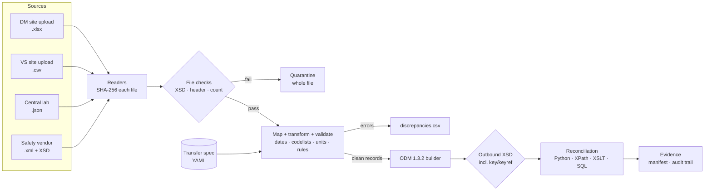

# clinical-edc-import-validator

[](https://github.com/lalithsagarkondapalli/clinical-edc-import-validator/actions/workflows/ci.yml)

**Spec-driven import, validation and reconciliation of clinical study data into an EDC-ready
CDISC ODM 1.3.2 file, with an audit trail and traceable test evidence.**

Four source transfers in four formats (site Excel and CSV uploads, a central-lab JSON feed, a
safety-vendor XML feed) are mapped according to a YAML transfer specification. Every record is
either loaded or rejected with a stable rule ID, and every count is reconciled three independent
ways before the file is released.

> All data is **synthetic** (study "CARD-301"). No real patients, sponsors or vendors.

---

## Why I built this
Most of the clinical data I've worked with (propensity-score matching on 395k+ records at USF
Morsani College of Medicine) arrived already cleaned. I wanted to build the step *before* that:
the controlled transfer where a lab or site file becomes study data, and where the job is to
prove that nothing was lost, changed silently, or loaded without passing the spec.

## How it works



## Results on the reference dataset

```
$ python -m edcimport run --spec specs/CARD301_transfer_spec.yaml --out out --run-date 2026-04-15
dataset               source  accepted  rejected  in ODM  status
DM                        11         7         4       7  PASS
VS                        16         5        11       5  PASS
LB                         7         5         2       5  PASS
AE                         5         3         2       3  PASS
ODM schema valid: True

$ python -m edcimport verify-audit out/<run_id>/audit_trail.jsonl
OK: 17 entries, chain intact

$ python -m edcimport load-staging out/<run_id>
SQL reconciliation: PASS
```

All 20 rejections are seeded on purpose and each one is documented, with the rule it should
trigger, in [docs/VALIDATION_PLAN.md](docs/VALIDATION_PLAN.md#4-seeded-errors-in-the-reference-dataset).
Two VS rejections are a *cascade*: S02-003 and S03-002 failed DM, so their vitals have no
registered subject and are rejected instead of being loaded as orphans.

## What the job asks for → where it is in this repo

| Requirement | Where |
|---|---|
| Prepare, transform, upload, validate CSV / Excel / XML / JSON | [`edcimport/readers.py`](edcimport/readers.py), [`validate.py`](edcimport/validate.py) |
| Develop transfer programs from approved specs | [`specs/CARD301_transfer_spec.yaml`](specs/CARD301_transfer_spec.yaml) drives all mapping; code has no study-specific logic |
| XML files, schemas, namespaces, mappings; CDISC XML | Namespaced vendor XML + XPath, [inbound XSD](schemas/safety_vendor_v2.xsd), [ODM 1.3.2 output](edcimport/odm.py), [outbound XSD with key/keyref](schemas/odm1-3-2_import_subset.xsd), [XSLT flatten](xslt/odm_to_long_csv.xsl) |
| Review completeness, structure, field values, record counts, metadata | Record-level rules + file header/record-count checks + ODM `ItemDef` metadata generated from the spec |
| Test cases, discrepancies, regression testing, validation evidence | 50 pytest cases tagged to [requirements](validation/requirements.yaml), golden-baseline regression, generated traceability matrix |
| SQL, Oracle, SQL*Loader | [SQLite staging + reconciliation SQL](sql/sqlite/) (run in CI), [Oracle DDL + SQL*Loader control file](sql/oracle/) (reference) |
| PowerShell | [`scripts/Invoke-StudyImport.ps1`](scripts/Invoke-StudyImport.ps1) scheduler wrapper, run in CI |
| Source code, version history, change control | Git, [CHANGELOG](CHANGELOG.md), [change control](docs/CHANGE_CONTROL.md), CI on every push |
| Audit trail, data integrity, 21 CFR Part 11 awareness | [Hash-chained audit log](edcimport/audit.py), input SHA-256s, runs never overwrite prior evidence |
| AI-assisted development with human review | [docs/AI_ASSISTED_DEVELOPMENT.md](docs/AI_ASSISTED_DEVELOPMENT.md) |

## Validation rules

| Rule ID | Check | Level |
|---|---|---|
| `F-XSD` | Inbound XML fails vendor schema | file → quarantine |
| `F-COUNT` / `F-HDR` | JSON header record count / vendor / study mismatch | file → quarantine |
| `V-REQ` | Required value missing | record |
| `V-TYPE` | Not an integer / decimal (catches `abc`, `0,9`) | record |
| `V-DATE` | Not a valid date in an accepted format | record |
| `V-FUTURE` | Date after the run date | record |
| `V-RANGE` | Outside spec range (checked **after** unit conversion) | record |
| `V-CODE` | Not in spec codelist | record |
| `V-UNIT` | Unit has no conversion factor | record |
| `V-LEN` | Text longer than the spec allows | record |
| `V-SUBJ-PATTERN` | Subject ID does not match the protocol pattern | record |
| `V-SUBJ-REF` | Subject not in accepted DM | record |
| `V-SITE` | DM site unknown or inconsistent with subject ID | record |
| `V-VISIT` | Visit label not in the spec visit map | record |
| `V-DUP` | Duplicate record key (first kept) | record |
| `VS-CF-01`, `AE-CF-01` | Cross-field rules from the spec | record |

A record with any `error` is rejected in full; it is never partially loaded. `warning`s are
reported and the record still loads.

## Reconciliation: why three ways
The code that builds the ODM file is not trusted to check itself.

1. **Python counts**: source = accepted + rejected, per dataset.
2. **XPath on the written file**: `count(//odm:ItemGroupData[@ItemGroupOID='IG.VS'])` must equal accepted.
3. **XSLT + SQL**: the ODM is flattened by XSLT to one row per `ItemData` and loaded into a staging
   table. SQL checks record counts, orphan subjects, site consistency and balance
   ([02_reconciliation_checks.sql](sql/sqlite/02_reconciliation_checks.sql)).

A test deletes one subject's DM rows from staging and confirms the SQL checks catch it.

## Sample output (ODM 1.3.2)
```xml
<SubjectData SubjectKey="S01-001">
  <SiteRef LocationOID="S01"/>
  <StudyEventData StudyEventOID="SE.SCR">
    <FormData FormOID="F.DM">
      <ItemGroupData ItemGroupOID="IG.DM" ItemGroupRepeatKey="1">
        <ItemData ItemOID="I.DM.SUBJID" Value="S01-001"/>
        <ItemData ItemOID="I.DM.BRTHDTC" Value="1968-04-12"/>
        <ItemData ItemOID="I.DM.SEX" Value="M"/>
        ...
```

## Quick start
```bash
git clone https://github.com/lalithsagarkondapalli/clinical-edc-import-validator.git
cd clinical-edc-import-validator
pip install -r requirements.txt

pytest -v                                   # 50 tests + traceability matrix in out/test_evidence/
python -m edcimport run --spec specs/CARD301_transfer_spec.yaml --out out --run-date 2026-04-15
```
PowerShell 7+:
```powershell
./scripts/Invoke-StudyImport.ps1 -Spec specs/CARD301_transfer_spec.yaml -OutDir out -RunDate 2026-04-15
```

## Repository layout
```
specs/        transfer specification (single source of truth for mapping + rules)
data/source/  synthetic inbound files with seeded errors
schemas/      inbound vendor XSD, outbound ODM 1.3.2 subset XSD
edcimport/    readers, validator, ODM builder, audit trail, pipeline, CLI
xslt/         ODM → long CSV flatten (round trip + staging load)
sql/          SQLite staging + reconciliation checks; Oracle DDL + SQL*Loader control file
scripts/      PowerShell job wrapper, DM workbook generator
tests/        pytest suite tagged by requirement ID, golden discrepancy baseline
validation/   requirements list
docs/         validation plan, change control, AI-assisted development statement
```

## Limitations and next steps
- The outbound XSD is a strict *subset* of ODM 1.3.2, not the official CDISC schema.
- The audit trail is tamper-*evident*, not tamper-proof, and there are no e-signatures or access
  control, so this is not a Part 11 system.
- Next: a transactional (`FileType="Transactional"`) mode with `AuditRecord`s, a Define-XML export of
  the spec, and a long-format lab reader (one row per test code).
